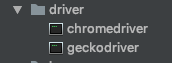
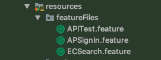
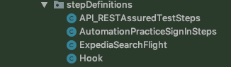
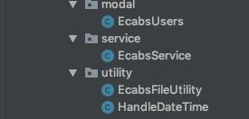
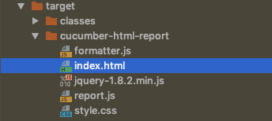
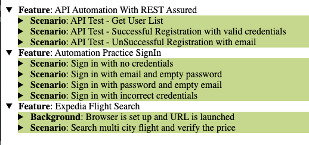

# selenium_BDD_framework

Behavioural driven development automation framework using selenium, cucumber-java, testng and maven

##Tools and technologies used:

1. Language: Java 8
2. Testing framework: Testng
3. BDD framework: Cucumber
4. Automation tool: Selenium webdriver
5. Build tool: maven
6. Logging: log4j
7. API Automation: RestAssured

##Features of the framework
1. BDD framework using Cucumber. Feature files can be written easily using Given,When, Then etc.
2. Browser(chrome/firefox) can be configured at run time  from command line (or Continuous integration tool, if configured).
3. API Tests can run using Rest Assured and java.
4. Screenshot would be taken if any scenario failed and saved under /outputFiles folder.
5. Html report gets generated after each test run and can be found /target/cucumber-html-report/index.html

**package: driver** : It has executable files of chromedriver and firefox driver. This is required while creating the webdriver session.

**package: featureFiles** : It contains all different features (tests) files. 

**package: testRunners** : It includes the main driving class which runs all the tests present in test suit depending on the parameters passed in @tag section.It includes the common classes (and methods) which are required by each test to perform actions. Below are classes in this package:

**package: stepDefinitions** : It includes the corresponding feature files definitions in java.It includes the common classes (and methods) which are required by each test to perform actions. Below are classes in this package:

**package: modal,service and utility** : It includes the common classes (and methods) which are required by each test to perform actions. Below are classes in this package:

**Hook.java** : It contains Before and After assertion for each test which gets executed automatically.
**ecabsTest.log** : It contains all the logs which can be used to track the past execution and present as well.

**package: outputFiles :** All the output files will be stored here (screenshots/csv/txt files) in case of failure of any test.

**index.html:** It will have test execution report:

Test execution (Index.html) report will look as below:

##Setting up the project

Install the maven and clone the build then got to terminal or command prompt:

**$ cd Navigate to the project**

**$ mvn clean install**

##Execution of tests  
There are 2 ways we can execute the test (by default browser would be chrome):

**1. Individually by tagging**

We can provide tag name in the feature file on top (ex. @anyName ) and same we can pass in testRunner.java class in @tag parameter. Example is shown in testRunner.java 

**2. All the tests at a time**

**$ mvn test**

To run test with configurable browser (for firefox, use -Dbrowser=firefox)

**$ mvn test -Dbrowser=chrome**

To run specific scenario:

**$ mvn test -Dcucumber.options="--tags @tagName"**

To run multiple mentioned scenarios:

**$ mvn test -Dcucumber.options="--tags @tagName1,@tagName2"**
